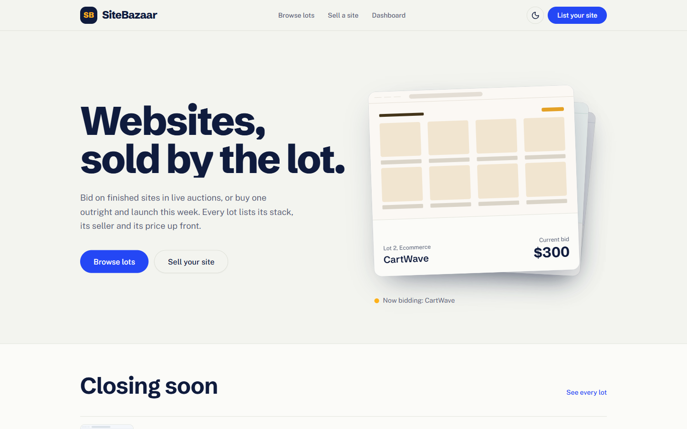
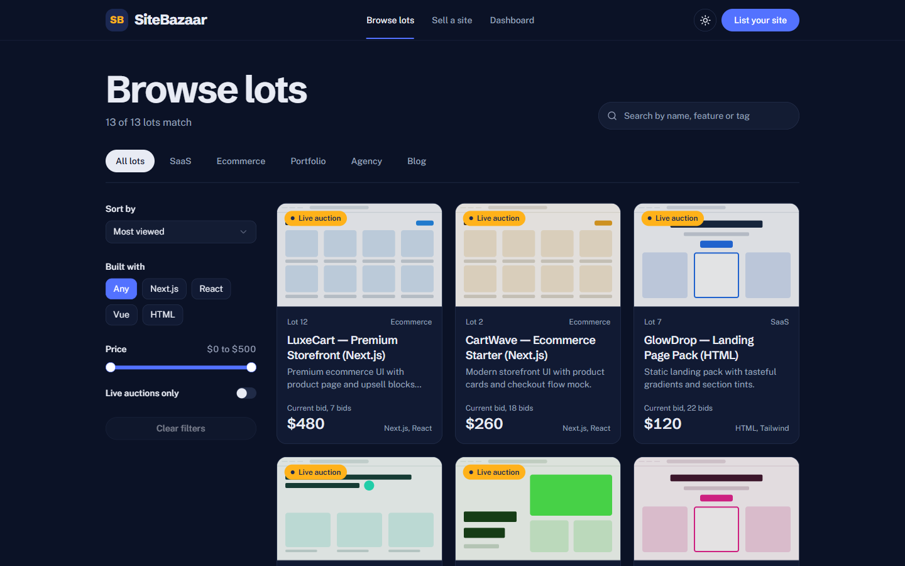
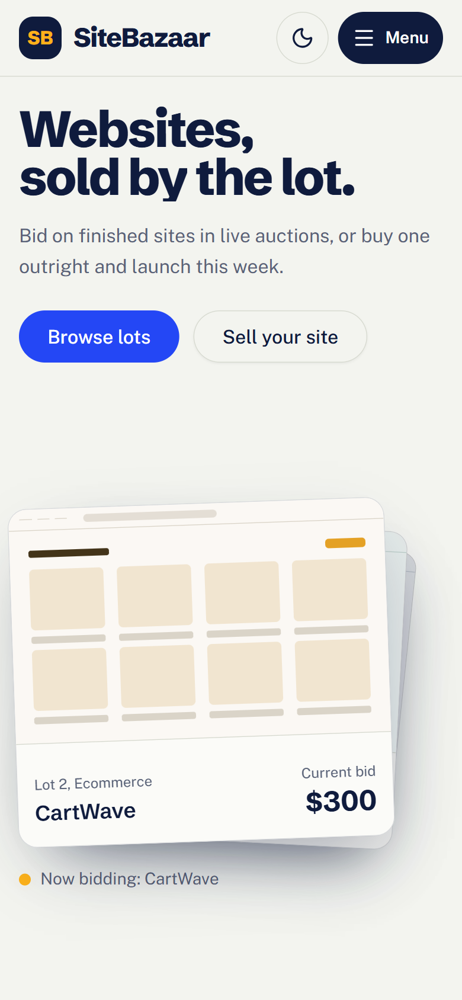

# SiteBazaar: websites, sold by the lot

A marketplace for buying and selling websites, designed like an auction house. Browse lots, bid in
live auctions, or buy a finished site outright. Frontend only: listings, bids, purchases and your
watchlist are stored in the browser's localStorage and no payment is taken.

- **Live site:** https://sitebazaar.vercel.app
- **Mirror on GitHub Pages:** https://ali-sazzad.github.io/sitebazaar/



| Dark mode | On a phone |
| --- | --- |
|  |  |

## Tech stack

- Next.js 16 (App Router, React Compiler) with React 19 and TypeScript
- Tailwind CSS 4 with shadcn/ui (Radix primitives); Schibsted Grotesk and Public Sans via next/font
- GSAP 3 with `@gsap/react` (SplitText, ScrollTrigger, Flip, ScrollToPlugin)
- Sonner for toasts

## Motion (GSAP)

Motion is used either for one orchestrated moment or in response to what the visitor does.

| Where | What | GSAP |
| --- | --- | --- |
| Home hero | Headline words rise in, then three auction lots are dealt onto a board. The front lot takes live bids and the stack rotates | Timeline, SplitText, `delayedCall` |
| Bid amounts | Prices count up to their new value and flash when a bid lands | Tweened counter (`CountUp`) |
| How a sale works | The progress rule fills as you scroll through the three steps | ScrollTrigger (scrubbed) |
| Browse lots | Cards glide to their new positions when filters change | Flip |
| Auction room | New bids slide into the history | `gsap.from` on the new row |
| Checkout | A "Sold" stamp comes down on purchase | `fromTo` with `back.out` |
| Watchlist | The heart pops when you save a lot | Elastic ease |
| Header | On desktop it hides on scroll down and returns on scroll up (on phones it stays pinned); the active-page underline slides between links | ScrollTrigger, matchMedia |
| Back to top | A ring around the button fills with reading progress; tapping it scrolls smoothly to the top | ScrollTrigger (scrubbed), ScrollToPlugin |
| Theme toggle | The sun/moon icon spins in when switching between light and dark | `fromTo` with `back.out` |

Site previews also carry a CSS skeleton shimmer, staggered per lot so a grid sweeps in a wave.

Everything checks `prefers-reduced-motion`. Reduced-motion visitors, and anyone without JavaScript,
get the final state straight away.

## Features

- Light and dark themes: follows the system setting by default, with a toggle in the header that
  remembers your choice
- Home: live lot board, auctions closing soonest, category index, sale process
- Browse lots: search, category, technology, price range, auction-only filter and sort, all saved
  between visits. Category links from the home page (`/marketplace?category=SaaS`) apply straight away
- Lot page: generated site preview, included pages, seller, buy now with escrow fee breakdown,
  watchlist
- Auction room: live countdown, minimum increments, quick-bid amounts, simulated rival bidders,
  bid history
- Sell: validated listing form with live preview and optional auction closing time
- Dashboard: your bids, watchlist, purchases, listings and recently viewed lots
- Loading skeletons wherever content waits on browser data
- Per-lot page titles and descriptions, favicon and home-screen icon, share preview image, skip
  link, visible focus, labelled controls

## Getting started

```bash
npm install
npm run dev
```

Then open http://localhost:3000.

## Deployment

Every push to `main` deploys to two places:

- **Vercel** (https://sitebazaar.vercel.app) builds the app as a normal Next.js project.
- **GitHub Pages** (https://ali-sazzad.github.io/sitebazaar/) gets a static export, built by
  `.github/workflows/deploy-pages.yml`. The export only switches on when `PAGES_BASE_PATH` is set,
  so local development and Vercel are unaffected.

To reproduce the Pages build locally:

```bash
PAGES_BASE_PATH=/sitebazaar npm run build   # writes the static site to ./out
```

## Project structure

```
src/
  app/                 routes (home, marketplace, listing/[id], auctions/[id], sell, dashboard)
  components/
    home/              hero lot board, closing soon, category index, sale process
    listing/           listing card, generated site preview, watchlist button
    motion/            CountUp and the no-JS reveal flag
    layout/            header, footer, back to top, theme provider and toggle
    ui/                shadcn/ui primitives
  lib/
    motion/gsap.ts     registers GSAP plugins in one place
    format.ts          money, lot numbers, countdowns
    browse/            filter and sort pipeline
    auction/ bids/ favorites/ purchases/ recent/ listings/   localStorage-backed state
```
